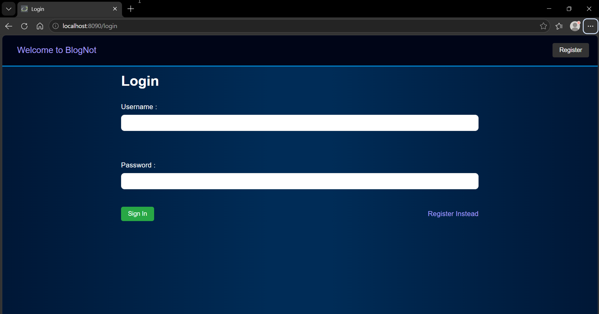
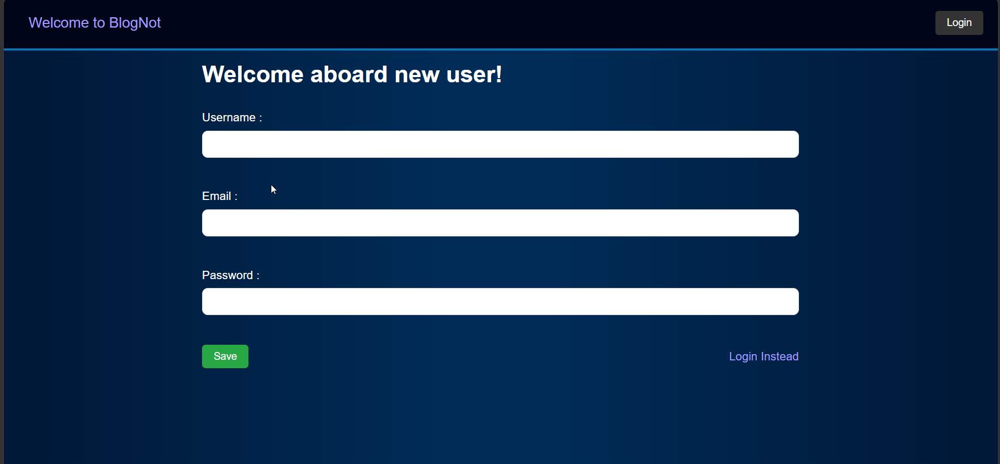
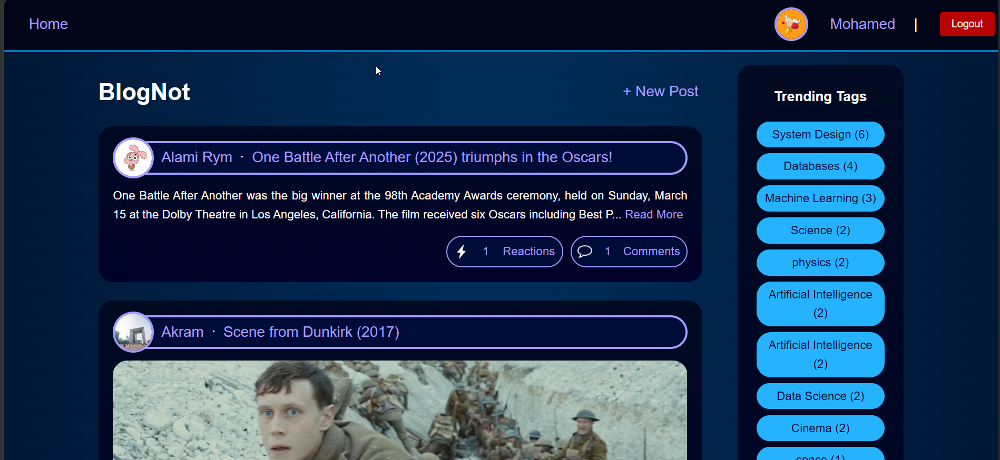
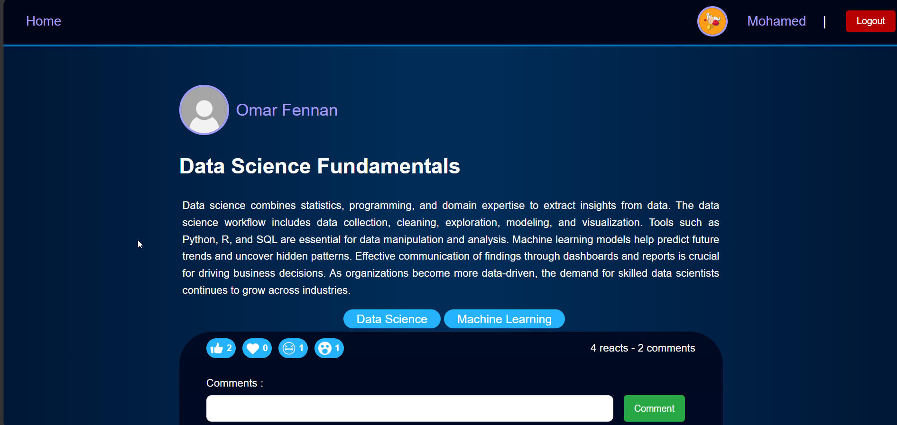
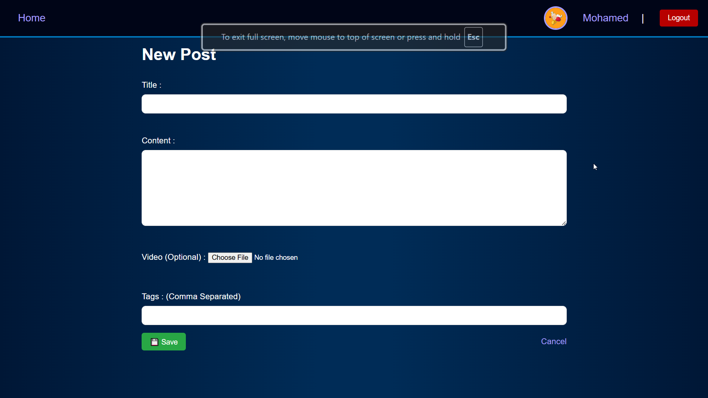
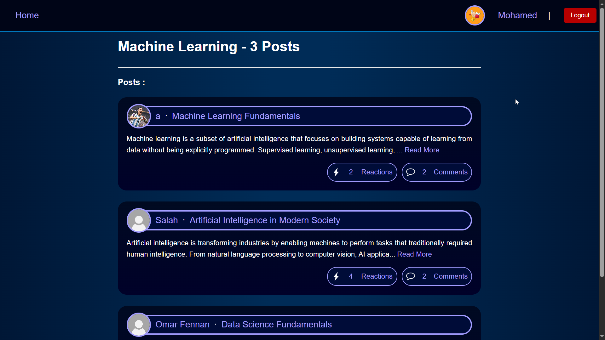
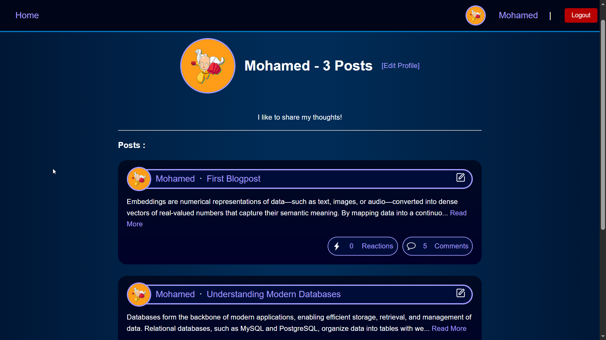
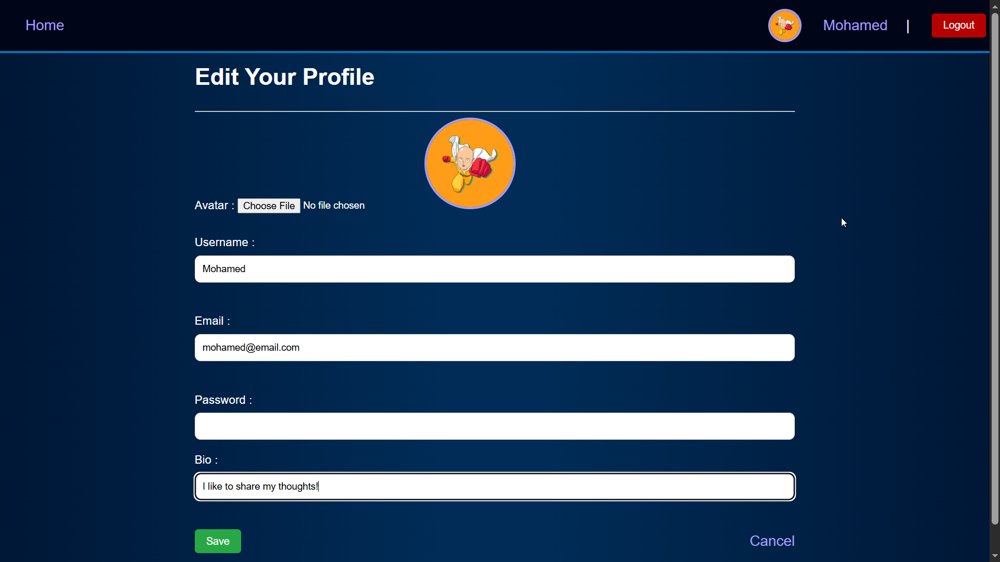

# 📝 Blog App

A full-stack blogging platform built with **Spring Boot**, **Spring Security**, **Thymeleaf**, and **MySQL**. Users can register, write text or video posts, tag content, comment, react, and manage their profiles.

---

## 📸 Screenshots

### Login Page


### Registration Page


### Posts Feed


### Post Detail View


### Create / Edit Post


### Tag Details


### User Profile


### Edit Profile


---

## 🚀 Features

- **Authentication** — Register, login, and logout with Spring Security (BCrypt password hashing)
- **Posts** — Create, view, edit, and delete text posts (only the author can edit/delete their own)
- **Video Posts** — Upload a video file alongside a post (stored on disk, up to 500MB)
- **Tags** — Add comma-separated tags when creating a post; tags are created automatically if new; browsable tag pages ordered by popularity
- **Comments** — Leave comments on any post
- **Reactions** — React to posts (like/dislike style)
- **User Profiles** — Each user has a profile with a bio and avatar image upload
- **REST API** — Endpoints available under `/api/**` for posts and users (CSRF-exempt)

---

## 🛠️ Tech Stack

| Layer        | Technology                        |
|--------------|-----------------------------------|
| Backend      | Java 17+, Spring Boot             |
| Security     | Spring Security, BCryptPasswordEncoder |
| Persistence  | Spring Data JPA, Hibernate        |
| Database     | MySQL 8+                          |
| Templating   | Thymeleaf                         |
| Build tool   | Maven          |
| Styling      | Custom CSS                        |

---

## ⚙️ Prerequisites

Before running the project, make sure you have:

- **Java 17** or higher installed
- **MySQL 8+** running locally
---

## 🗄️ Database Setup

1. Open your MySQL client (MySQL Workbench, DBeaver, or terminal).
2. Create the database:

```sql
CREATE DATABASE blog_db;
```

3. Make sure your MySQL user has access to it. Hibernate will auto-create the tables on first run (`ddl-auto=update`).

---

## 🔧 Configuration

Open `src/main/resources/application.properties` and update the following to match your environment:

```properties
# Replace with your DB host, port, and database name
spring.datasource.url=jdbc:mysql://localhost:3306/blog_db

# Replace with your MySQL username
spring.datasource.username=root

# Replace with your MySQL password (leave empty if none)
spring.datasource.password=
```

---

## ▶️ Running the App

```bash
# Clone the repository
git clone https://github.com/YOUR_USERNAME/blog-app.git
cd blog-app

# Build and run
./mvnw spring-boot:run        # Linux / Mac
mvnw.cmd spring-boot:run      # Windows
```

Or run via IntelliJ IDEA.

Then open your browser at: [http://localhost:8090](http://localhost:8090)

---

## 📁 Project Structure

```
blog-app/
├── docs/
│   └── screenshots/          # App screenshots for README
├── src/
│   └─ main/
│       ├── java/com/example/blog/
│       │   ├── dao/
│       │   │   ├── entities/         # JPA entities: User, Post, VideoPost, Comment, Tag, React, Profile
│       │   │   └── repositories/     # Spring Data repositories
│       │   ├── service/              # Business logic (Manager + Service interfaces)
│       │   ├── web/                  # Controllers (MVC + REST)
│       │   ├── security/             # Spring Security config
│       │   └── run.java              # Main application entry point
│       └── resources/
│           ├── templates/            # Thymeleaf HTML templates
│           │   ├── posts/
│           │   ├── tags/
│           │   └── users/
│           ├── static/css/           # Stylesheets
│           └── application.properties
│
├── uploads                    
│     ├─ avatars/                     # Users profiles avatars
│     ├─ icons/                       # Application Icons
│     └─ videos/                      # Videos uploaded by users Icons
├── mvnw                              # Maven wrapper (Linux/Mac)
├── mvnw.cmd                          # Maven wrapper (Windows)
├── pom.xml                           # Project dependencies and build config
└── README.md
```

---

## 🌐 Web Routes

| Route                  | Description                          |
|------------------------|--------------------------------------|
| `/login`               | Login page                           |
| `/register`            | Registration page                    |
| `/posts`               | All posts feed                       |
| `/posts/{id}`          | Single post view with comments       |
| `/posts/new`           | Create a new post                    |
| `/posts/{id}/edit`     | Edit a post (author only)            |
| `/posts/{id}/delete`   | Delete a post (author only)          |
| `/tags`                | Browse all tags                      |
| `/tags/{id}`           | Posts under a specific tag           |
| `/users/{id}`          | View a user profile                  |
| `/users/{id}/edit`     | Edit your own profile                |

---

## 📂 File Uploads

Uploaded files (avatars and videos) are saved to the local `uploads/` directory at the project root:

```
uploads/
├── avatars/
└── videos/
```
---

## 🔒 Security Notes

- Passwords are hashed with **BCrypt** — never stored in plain text.
- Only authenticated users can access any page except `/login`, `/register`, and `/api/**`.
- Post editing and deletion are restricted to the post's author.
- Profile editing is restricted to the account owner.

---

## 📌 Known Limitations

- [ ] Pagination for the posts feed
- [ ] Image posts support
- [ ] Admin role and moderation tools
- [ ] Email verification on registration
- [ ] Deploy to a cloud platform (Railway, Render, AWS, etc.)

---

## 📄 License

This project is totally open source, released into the public domain under the [Unlicense](LICENSE).